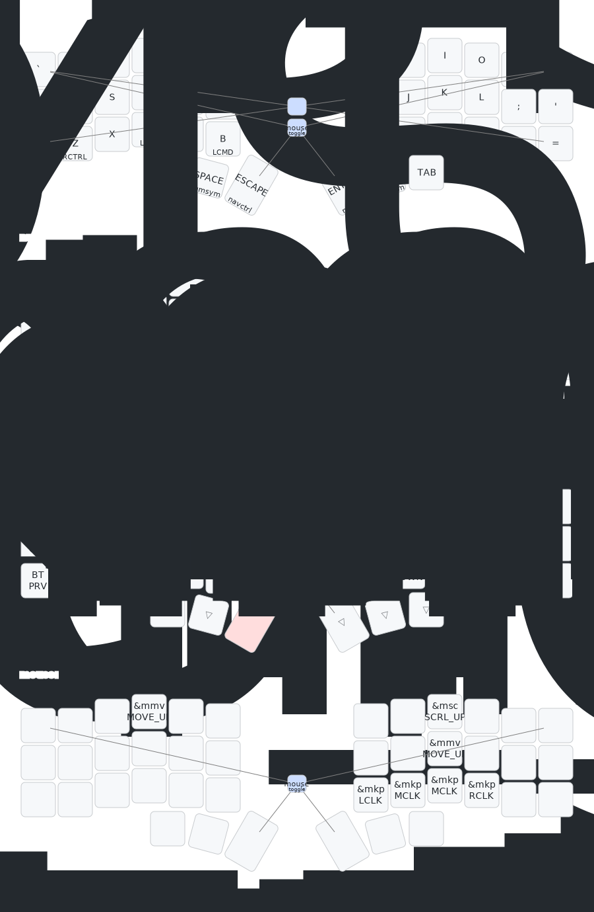

# MDK Layout 
This configuration is inspired by miryoku layout. Its still a work in progress as I get used to the corne keyboard. The main areas of this layout focuses on are:
1. QWERTY compatible
2. nvim/tmux focused navigation layer
3. symbol and number layer

